# Google Calendar API
see https://developers.google.com/calendar/caldav/v2/guide

- SignIn on [https://console.developers.google.com/projectselector/apis/credentials](https://console.developers.google.com/projectselector/apis/credentials)
- Click on create a project [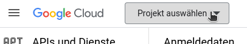](images/google/Utkgrafik.png)

[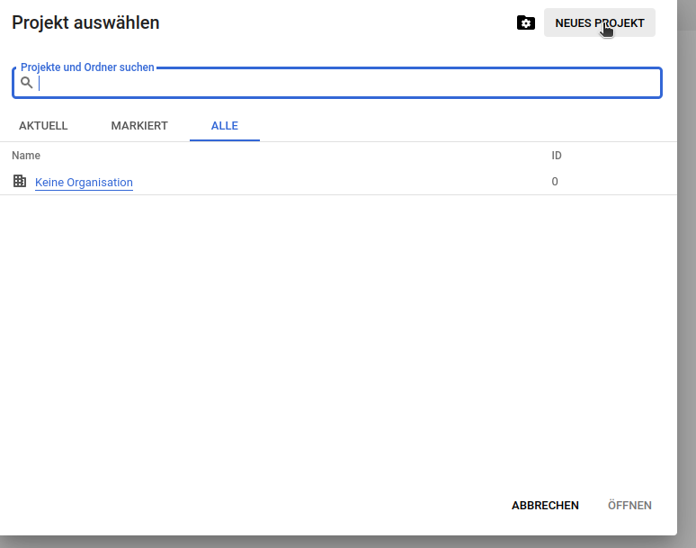](images/google/Fb0grafik.png)

[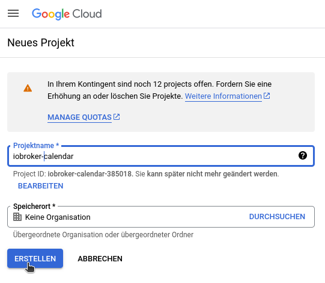](images/google/xPmgrafik.png)

Configure consent screen

- UserType external

[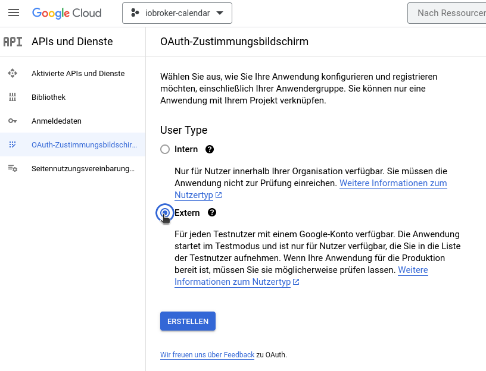](images/google/KUcgrafik.png)

- for Application Name use `ioBroker.webCal`
- choose your email adress for support and developer contact

- click save three times
- click back to dasboard
- Set publishing to production

[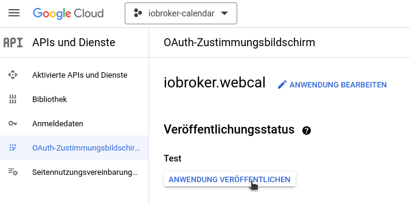](images/google/vmpgrafik.png)

Click on "+ create Credentials" and add new OAuth Client ID

- type Webapplication
- name `ioBroker.webCal`
- Authorized redirect URIs: `https://developers.google.com/oauthplayground`
- click on "Create" and download JSON in next screen

[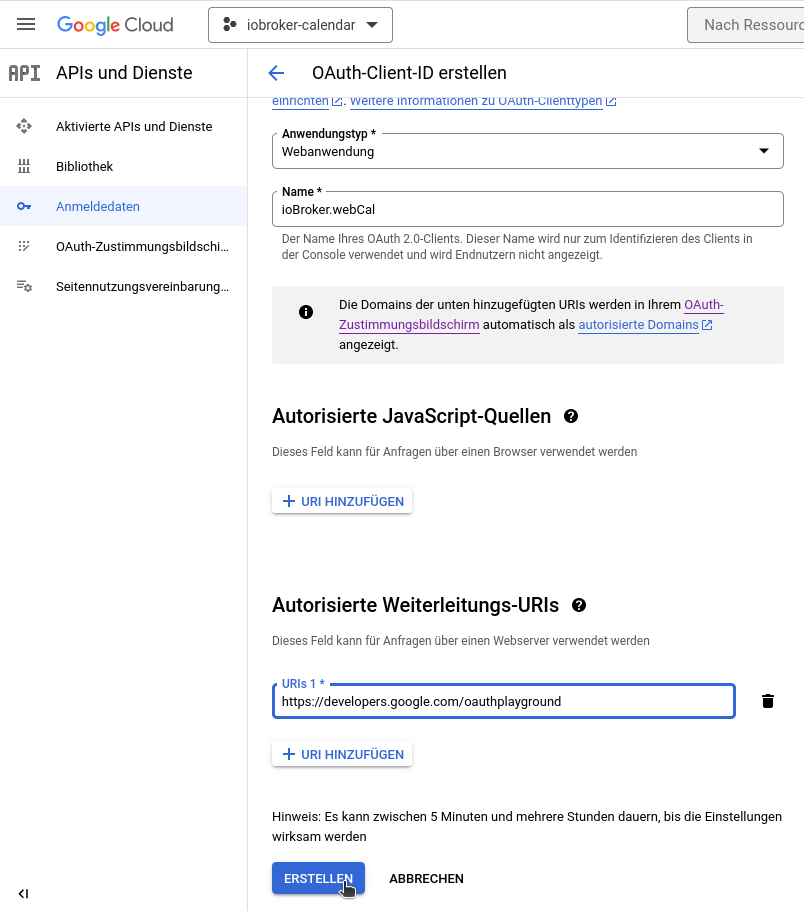](images/google/kUXgrafik.png)

- Click Library on the side menu
- search for "webdav" and click on result tile 

[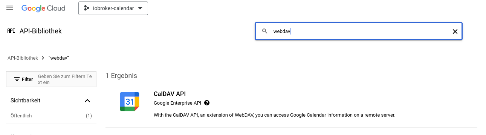](images/google/S5sgrafik.png)
- Click Enable to enable the calDAV API.

[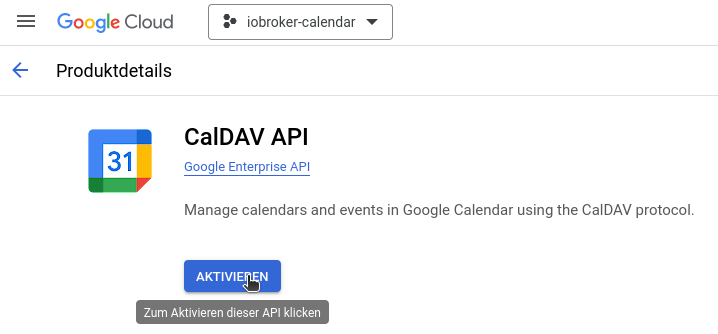](images/google/VCigrafik.png)

Open [OAuth 2.0 Playground](https://developers.google.com/oauthplayground/)

- click OAuth 2.0 Configuration button in the Right top corner.
- Select `Use your own OAuth credentials` in the bottom and provide the Client ID and Client Secret values from JSON file.

[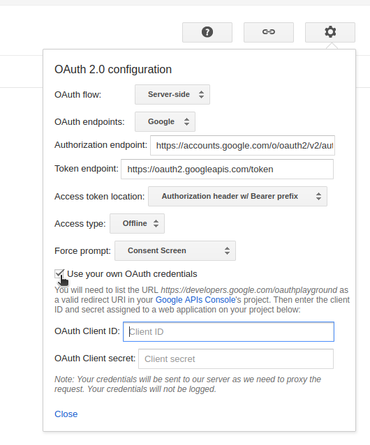](images/google/CCZgrafik.png)

- click close
- Under Step 1 on left side search for Google Calendar and click on  
    `https://www.googleapis.com/auth/calendar` and [`https://www.googleapis.com/auth/calendar.events`](https://www.googleapis.com/auth/calendar.events)  
    [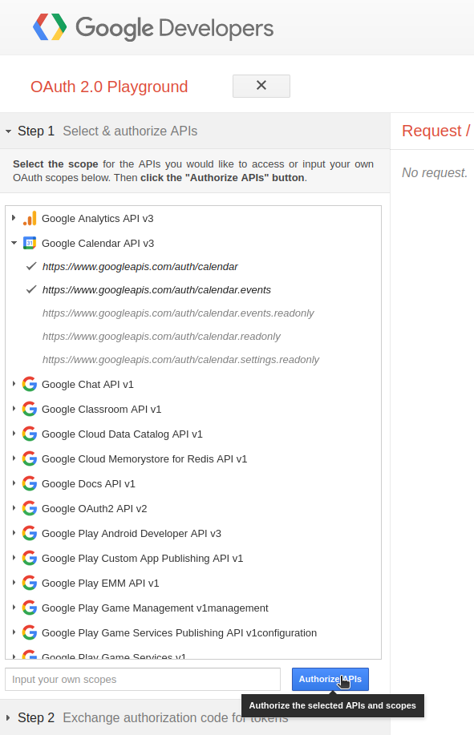](images/google/tsLgrafik.png)
- click on Authorize API's 
    - now you have to accept and trust yourself.... (perhaps you have to click on advanced)
    - [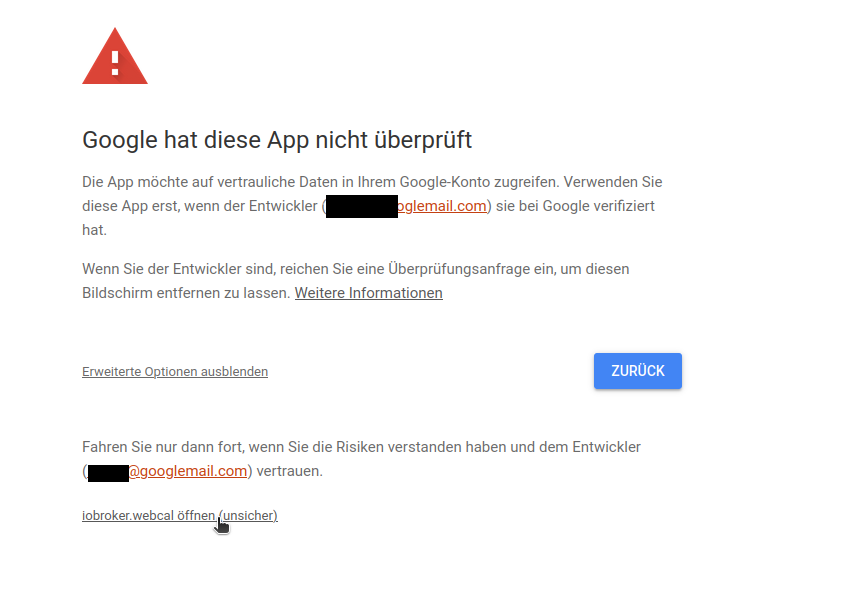](images/google/0Elgrafik.png)
        
        [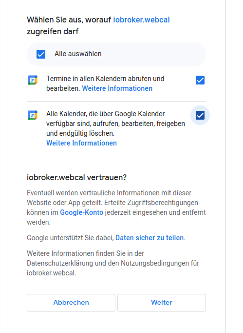](images/google/8hMgrafik.png)

- Click `Button Exchange authorization code for tokens` on Step 2  
    [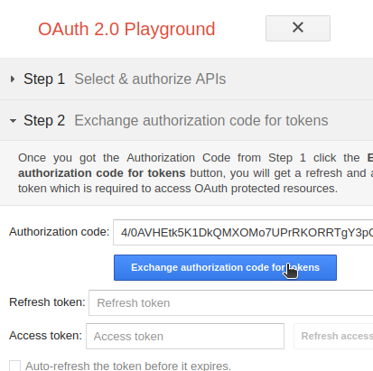](images/google/LW2grafik.png)
- here we need the refresh-token

Use the following settings in ioBroker

- auth Methold = google
- Secret = Client Secret (from JSON file)
- refresh token = which you get from above
- client ID = your clientID (from JSON file)